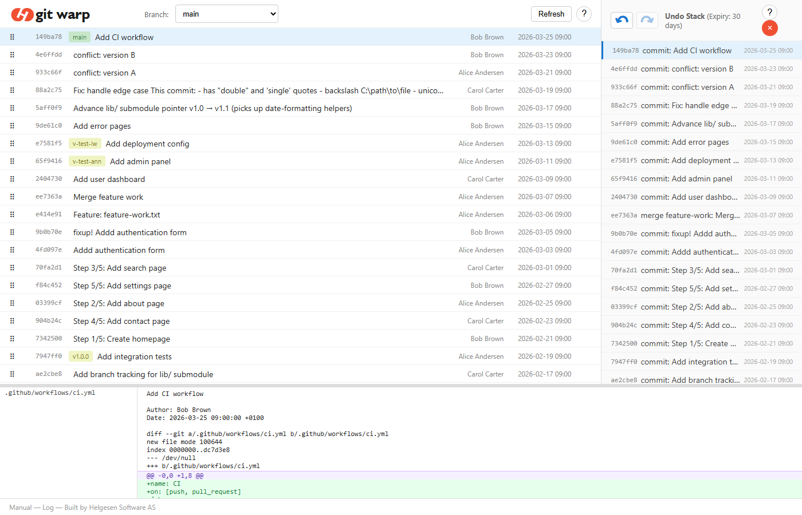

# git warp

[](https://pypi.org/project/git-warp/)
[](LICENSE.md)

Rewrite git history in your browser with unlimited undo.
Reorder, squash, fixup, reword, and split commits.

Run git warp from inside any git repository, after stashing or committing changes. The UI uses the installed git version to rewrite history and provide full undo. 



## Install

```bash
pip install git-warp
```

This installs the `git warp` subcommand.

## Usage

Run from inside any git repository:

```bash
git warp
```

This opens a git UI to rewrite your commit history. 
The manual can be opened from the UI.


## Requirements

- Python >= 3.7
- Git >= 2.26

## License

GPL-3.0 — see [LICENSE.md](LICENSE.md).
